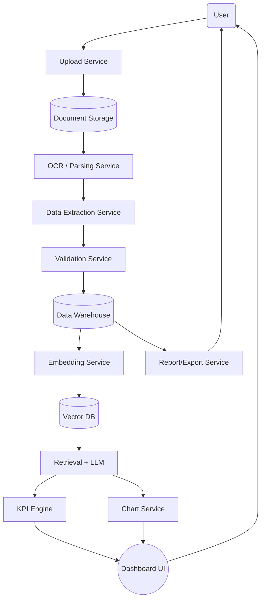

# Base Platform — MVP

Enterprise GenAI Knowledge & Workflow Platform

## What this does
- Upload PDF, TXT, Markdown, and CSV documents
- Ask questions → grounded answers via RAG
- Source citations with relevance scores
- Extract audit KPIs, validation issues, and chart-ready analytics
- Export audit analytics to CSV
- Detect anomaly signals and generate audit insight cards
- Export Tableau/PowerBI-friendly JSON datasets
- Ask AI questions in multiple response languages
- Multi-tenant by design

---

## Quick Start

### Prerequisites

- Python 3.9+.
- An OpenAI API key. Uploading and querying documents uses OpenAI embeddings/LLM calls.

### 1. Configure the backend

```bash
cd backend
python3 -m venv venv
source venv/bin/activate        # Windows: venv\Scripts\activate
pip install -r requirements.txt
cp .env.example .env
```

Open `backend/.env` and set:

```bash
OPENAI_API_KEY=sk-your-key-here
ANTHROPIC_API_KEY=optional-if-you-add-anthropic-model-support
```

`OPENAI_API_KEY` is required for the current app because document ingestion uses OpenAI embeddings and chat uses the configured OpenAI LLM. `ANTHROPIC_API_KEY` is included as a placeholder for future Anthropic model support; the current code does not call Anthropic yet.

The app stores local runtime data under `backend/data/` and Chroma vectors under `backend/chroma_db/` by default.

### 2. Start the backend API

From the `backend/` directory:

```bash
source venv/bin/activate
python3 -m uvicorn app.main:app --reload --host 0.0.0.0 --port 8000
```

Backend URL: http://localhost:8000  
Swagger docs: http://localhost:8000/docs  
Health check: http://localhost:8000/health

### 3. Start the frontend

Open a second terminal:

```bash
cd frontend
python3 -m http.server 3000
```

Frontend URL: http://localhost:3000

You can also open `frontend/index.html` directly in a browser. When served on port `3000` or opened as a local file, the frontend calls the backend at `http://localhost:8000`.

### 4. Use the app

1. Visit http://localhost:3000.
2. Upload a PDF, TXT, Markdown, or CSV audit document.
3. Review extracted KPIs, chart data, validation issues, and audit events on the dashboard.
4. Review Version 2.0 insight cards, anomaly signals, pivot tables, and multi-axis trends.
5. Ask questions in the AI chat and choose the response language from the top bar.
6. Export extracted analytics with `Export CSV`, `Export Tableau`, or `Export PowerBI`.

### Troubleshooting

- If `uvicorn` is not found, use `python3 -m uvicorn ...` as shown above.
- If ChromaDB fails with a NumPy 2.x error, reinstall dependencies with `pip install -r backend/requirements.txt`; this project pins `numpy<2`.
- If OpenAI/httpx fails with a `proxies` argument error, reinstall dependencies; this project pins `httpx<0.28`.
- If uploads fail, confirm `OPENAI_API_KEY` is set in `backend/.env` and restart the backend.

---

## Project Structure

```
base-platform/
├── backend/
│   ├── app/
│   │   ├── main.py              # FastAPI app
│   │   ├── core/config.py       # Settings from .env
│   │   ├── api/
│   │   │   ├── ingest.py        # POST /api/ingest/
│   │   │   ├── query.py         # POST /api/query/
│   │   │   ├── documents.py     # GET/DELETE /api/documents/
│   │   │   └── analytics.py     # Dashboard, audit log, CSV export
│   │   └── services/
│   │       ├── ingestion.py     # File parsing + chunking
│   │       ├── vector_store.py  # ChromaDB operations
│   │       ├── rag.py           # RAG pipeline
│   │       ├── analytics.py     # KPI extraction + chart data
│   │       ├── storage.py       # Local document/JSON storage
│   │       └── audit_log.py     # JSONL audit trail
│   ├── requirements.txt
│   └── .env.example
└── frontend/
    └── index.html               # Complete single-file UI
```

---

## API Reference

| Method | Endpoint | Description |
|--------|----------|-------------|
| POST | /api/ingest/ | Upload & index a document |
| POST | /api/query/ | Ask a question |
| GET | /api/documents/ | List documents |
| DELETE | /api/documents/{id} | Delete a document |
| GET | /api/analytics/dashboard | Audit KPIs, chart data, validation issues, and recent events |
| GET | /api/analytics/audit-log | Recent audit trail events |
| GET | /api/analytics/insights | Generated audit insight cards |
| GET | /api/analytics/anomalies | Statistical anomaly detection signals |
| GET | /api/analytics/export.csv | Export extracted analytics as CSV |
| GET | /api/analytics/export.tableau.json | Export Tableau-friendly JSON dataset |
| GET | /api/analytics/export.powerbi.json | Export PowerBI-friendly JSON dataset |

All endpoints accept x-tenant-id header (default: "default").

`POST /api/query/` also accepts an optional `language` field (`en`, `es`, `fr`, `de`, or `hi`) to control the AI response language.

---

## .env Config

```
OPENAI_API_KEY=sk-...
ANTHROPIC_API_KEY=
LLM_MODEL=gpt-4o
EMBEDDING_MODEL=text-embedding-3-small
DATA_DIR=./data
DOCUMENT_STORAGE_DIR=./data/documents
AUDIT_LOG_PATH=./data/audit_log.jsonl
CHUNK_SIZE=500
CHUNK_OVERLAP=50
RETRIEVAL_K=5
```

---

## Deployment

Backend → Railway.app ($5/mo)
Frontend → Vercel (free) — update API_BASE in index.html

Estimated cost for early users: < $10/month

---

# Executive Summary

The **Audit Analytics AI Platform** is an enterprise-grade SaaS that lets organizations upload audit documents and automatically extract insights with charts. In practice, an auditor or manager simply logs in (via SSO), uploads one or more audit reports or financial forms, and the system parses the documents (using OCR and AI) to extract key values and metrics. Behind the scenes, the platform runs intelligent pipelines (OCR, data extraction, AI analysis) and computes KPIs (e.g. compliance ratios, cost breakdowns). It then presents interactive charts and a dashboard so users can explore trends, drill down into details, and export reports. All actions are tracked in an audit trail. Enterprise requirements are built in: data is encrypted, fine-grained RBAC and SAML/OAuth logins are enforced, and a multi-tenant architecture supports scaling. In summary, this product turns raw audit documents into actionable analytics with minimal manual effort, aligning with best practices from Azure and AWS AI services.

## End-User Workflow

1. **Login & Authentication:** The user (auditor, analyst, or manager) logs in via corporate SSO (SAML/OAuth). Role-based access controls (RBAC) determine what the user can see.
2. **Document Upload:** The user uploads audit documents (PDFs, scanned images, spreadsheets, etc.) through the web UI.
3. **Preprocessing:** The system automatically routes the files to the upload service, which stores them securely. An OCR/Document AI service (for example, Azure Document Intelligence) extracts text, tables, and structured fields from the raw documents.
4. **Data Validation:** Extracted data is passed through business rule checks (e.g. format validation, cross-field consistency) to flag any errors or missing information. The user is prompted to review or correct if needed.
5. **AI Analysis & KPI Extraction:** Cleaned data is fed to the AI engine. A retrieval-augmented LLM analyzes content (for example, using vector search and GPT-4) to interpret context and compute insights. Specific KPIs are calculated (e.g. total audited amounts, exception counts, compliance ratios). All source references (document and page) are logged for traceability.
6. **Chart Generation:** The KPI results and underlying data are sent to the chart service. Predefined chart templates (bar charts, line graphs, pie charts, etc.) are populated with the data. Charts support interactivity (hover for details, filters) as described below.
7. **Dashboard & Alerts:** The user is presented with a dashboard containing the new charts and key figures. The system can also trigger alerts (e.g. email notifications) if anomalies are found (like a variance beyond a threshold).
8. **Exports & Reports:** The user can export data and charts to Excel, PDF, or business tools. All actions (uploads, review steps, exports) are logged in the audit trail for compliance.



Figure: End-to-end workflow from document upload to analytics (mermaid flowchart).

## Core Functionalities

- **File Upload:** Users upload audit files (PDF, CSV, images) via the web interface or API.
- **Parsing / OCR:** A Document AI service extracts text, tables, and fields from each page. This includes multi-language OCR and layout analysis.
- **Data Extraction & Structuring:** The raw text is transformed into structured records (database tables) representing audits, items, amounts, dates, etc.
- **Validation & Correction:** The platform applies validation rules (e.g. numeric ranges, required fields) and flags issues. Users can correct data in the UI.
- **RAG / LLM Analysis:** A Retrieval-Augmented Generation pipeline (vector search + LLM) provides advanced analysis. For example, the LLM can answer questions like “Which line items exceed budget?” or summarize audit findings, using company data for context.
- **KPI Calculation:** Predefined analytics (e.g. totals, averages, exception counts, compliance ratios) are computed from the extracted data.
- **Chart Generation:** The system generates visualizations (bar, line, pie charts, tables, etc.) for the KPIs. These charts are interactive (filterable, drill-down) and updated in real-time.
- **Dashboard:** A unified dashboard displays all charts, key metrics, and data summaries. Users can filter by date, audit type, or other fields.
- **Alerts/Notifications:** If the analysis finds exceptions (e.g. anomalies in data), configurable alerts are sent via email or in-app notifications.
- **Exports & Reports:** Users can download the processed data, charts, and analytics in standard formats (CSV, Excel, PDF) or send reports to BI tools.
- **Audit Trail:** Every action (upload, edits, exports, queries) is logged for compliance and traceability.

## Technical Components Mapping

Each functionality above maps to backend services:

- **File Upload Service:** An HTTP API (e.g. built with FastAPI) that receives files and stores them (e.g. in AWS S3 or Azure Blob).
- **Storage:** Object storage or blob storage for raw files.
- **OCR/Parsing Service:** A microservice calling a Document AI engine (e.g. Azure Form Recognizer or Google Document AI) to extract text and tables.
- **Data Extraction Service:** A data-engineering service (e.g. Python ETL) that converts OCR output into structured data, handling things like splitting tables, recognizing sections, etc.
- **Validation Service:** A rules engine (can be serverless or container) that checks and cleans data.
- **Database/Data Warehouse:** A secure relational or NoSQL database to hold the structured audit data.
- **Embedding Service:** A microservice that takes textual fields and computes vector embeddings (using an embedding model) to enable semantic search.
- **Vector Database:** A specialized DB (e.g. Pinecone, Weaviate) storing embeddings and metadata for RAG.
- **Retrieval + LLM Service:** A core AI service that takes user queries or analysis prompts, retrieves relevant document snippets from the vector DB, and calls a Large Language Model (e.g. hosted GPT-4 or an internal Llama) to generate answers or summaries.
- **KPI Engine:** A computation service (could be the same as analysis) that aggregates the structured data into metrics.
- **Chart Service:** A server or frontend library that renders charts. This might be integrated in the frontend (e.g. using D3.js or Chart.js) or generated on the backend.
- **Dashboard/UI:** A frontend application (React/Angular) presenting charts and tables to users.
- **Alerting Service:** Background jobs or serverless functions that watch data results and send notifications (e.g. AWS SNS or Azure Notification Hubs).
- **Export Service:** Generates reports or API endpoints for data export (e.g. CSV/Excel generation).
- **Audit Log Service:** A logging system (using Elasticsearch/Kibana or cloud logging) that records all user actions and system events.

## AI/ML Components

- **OCR/Document Intelligence:** Uses pretrained ML models (like Azure Document Intelligence or AWS Textract) for text and table extraction. These run either as cloud services or containerized ML services.
- **Embeddings:** A model (e.g. OpenAI embeddings or an open-source Sentence Transformer) converts key text into numeric vectors. This runs on GPU instances or cloud inference endpoints.
- **RAG (Retrieval-Augmented Generation):** Combines the vector DB with a Large Language Model. On each query or analysis task, the system retrieves top-k relevant document chunks (based on embeddings) and sends them to the LLM prompt. The LLM (e.g. GPT-4 or a fine-tuned Llama) generates answers. Multi-stage RAG (keyword filtering → semantic re-ranking) may be used for large doc sets. This orchestration can use frameworks like LangChain.
- **Fine-Tuning/Custom LLM:** If high customization is needed (e.g. for niche audit domains), a custom model can be fine-tuned on company-specific texts (using PEFT/LoRA) and hosted in the model service.
- **Analytics Models:** Simple ML/AI models or scripts compute trends and anomalies. For advanced insights (e.g. predicting compliance risk), additional models could be plugged in.
- **Caching:** Frequent queries or LLM responses may be cached in Redis to reduce API calls and latency.

## Deployment & Scalability

The platform is cloud-native, typically deployed on Kubernetes (K8s) for microservices. Key deployment notes:

- **Containers & K8s:** All services (APIs, OCR workers, embedding service, etc.) run in Docker containers orchestrated by Kubernetes. This allows horizontal scaling under load.
- **GPUs:** The LLM and embedding services run on GPU-backed nodes. GPU Auto Scaling can spin up more GPUs if query load increases.
- **Serverless Functions:** OCR and smaller ETL tasks might use serverless (AWS Lambda/Azure Functions) for event-driven processing (e.g. on file upload).
- **CI/CD:** Use pipelines (GitHub Actions or Azure DevOps) to build/test/deploy code and ML models.
- **Database Scaling:** The database is managed (e.g. Aurora, Cosmos DB) with read replicas. The Vector DB is managed by provider (Pinecone) or self-hosted with scaling.
- **High Availability:** Deploy across multiple availability zones. Use load balancers and health checks.
- **Monitoring:** Collect metrics (Prometheus, CloudWatch) for CPU/GPU usage, request latency, error rates. Auto-scale based on these metrics.
- **Cost Optimization:** Use spot instances or burstable instances where acceptable. Cache results to reduce expensive LLM calls.

These practices follow cloud architecture guides: e.g. AWS Well-Architected suggests using managed K8s and autoscaling for GenAI workloads, and Azure Cognitive Services abstracts many heavy ML tasks.

## Security & Compliance

- **Encryption:** All data in transit (TLS) and at rest (disk encryption, key management) are required. For example, S3/Azure Blob encryption and HTTPS everywhere.
- **Multi-Tenancy:** If serving multiple clients, separate each tenant’s data logically (e.g. database schemas or separate containers) and enforce strict isolation.
- **Single Sign-On (SSO):** Integrate with enterprise identity (SAML, OAuth2) so users sign in with corporate credentials.
- **RBAC & Permissions:** Role-based controls limit who can upload, view, or approve data. For example, “Analyst” vs “Manager” vs “Admin” roles with escalating privileges.
- **Audit Logs:** Record every action (file uploads, data edits, report generation) in an append-only log. This supports compliance audits and forensic analysis. Platforms like AWS CloudTrail or Elasticsearch can store these logs.
- **Data Residency:** Deploy the system in the customer’s required region or on-premise (private cloud) to satisfy data residency laws (e.g. GDPR).
- **Network Security:** Use private networks (VPC), restrict public internet access, and implement firewalls/security groups for service endpoints.
- **Credentials & Secrets:** Store service credentials (API keys, DB passwords) in secure vaults (AWS Secrets Manager / Azure Key Vault). Rotate regularly.
- **Governance:** Include approval workflows before deploying new AI models or workflows (MLOps control). Provide dashboards for administrators to monitor usage, costs, and compliance.
- **Compliance Standards:** Build to standards like SOC 2 or ISO 27001 by design (data encryption, access reviews, incident response). This aligns with enterprise “generative AI lens” guidelines.

## User Roles & Permissions

Typical user roles in this system might include:

- **Auditor/Analyst:** Can upload documents, view and filter data, and generate charts. Cannot change system settings.
- **Manager:** All Analyst permissions, plus ability to configure alerts and export reports.
- **System Admin:** Full access to manage users, roles, data connections, and system settings. Can deploy new models or integrations.
- **Compliance Officer:** Read-only access to dashboards and logs, plus permission to view audit trails for all actions.

RBAC is implemented in the backend: each API call checks the user’s role and scope. The UI also hides actions the user is not allowed to perform. All operations are tagged with the user’s identity in the audit log.

## Sample UI & Chart Types

The user interface includes screens for logging in, file upload, data review, and an analytics dashboard. Sample elements:

- **Upload Screen:** A simple drag-and-drop area to upload files. Shows status (“Processing…”) after upload.
- **Data Review Grid:** A table view of extracted data where users can correct values (e.g. editable fields for amounts).
- **Dashboard:** Shows charts and key metrics (see table below). Filters on top to select date ranges or categories.
- **Chart Tooltip:** Hovering over chart elements shows exact values and source references.
- **Alerts Panel:** Lists any triggered alerts or messages (e.g. “Invoice 123 missing signature”).
- **Settings/Export:** Options to download data or invite users.

Below is a table of example chart types:

| Chart Type | Purpose | Data Inputs | Interactivity |
|------------|---------|-------------|---------------|
| Bar Chart | Compare audit metrics by category | Category (e.g. department) vs Value (e.g. total cost) | Hover shows exact numbers; filter by category |
| Line Chart | Show trends over time (e.g. expenses) | Time series (dates) and a metric (e.g. monthly spend) | Hover shows date and value; zoom/select time range |
| Pie/Donut | Show distribution (e.g. cost breakdown) | Slice categories and sum of metric (e.g. by cost center) | Hover shows category percentages; click to isolate slice |
| Table/Grid | Detailed record list (e.g. line items) | Extracted data rows and columns (e.g. invoice line items) | Sortable columns; search and pagination |
| Scatter Plot | Identify correlations or outliers | Two numeric metrics (e.g. invoice amount vs. processing time) | Hover shows point details; select a point to highlight in table |

Table: Example chart types, their use, data inputs, and user interactions.

(These chart types are illustrative; actual offerings may include heatmaps, gauges, or KPI cards as needed.)

## Roadmap & Success Metrics

**Version 1.0 (MVP):** Focus on core ingestion and basic analytics. Features: file upload, OCR, data extraction, a set of standard charts, user authentication, and logging. Support PDF/CSV input and output to Excel/PDF.
**Version 2.0:** Implemented as a local MVP slice: RAG-based querying (“Ask a question about this audit”), statistical anomaly detection, generated audit insight cards, pivot tables, multi-axis trend data, Tableau/PowerBI JSON exports, and multi-language AI response support.
**Enterprise Edition:** On-prem deployment option, SAML SSO, audit report exports, fine-tuning interface, and customizable compliance workflows.

**Key Performance Indicators (KPIs):**

- *User Adoption:* Number of uploads or active users per month.
- *Processing Time:* Average time to process an upload (should be minutes or less).
- *Extraction Accuracy:* Percentage of correctly extracted fields (target >95% for key fields).
- *System Uptime:* Percentage uptime (target 99.9%).
- *Query Latency:* Time to generate an answer or chart (target <2 seconds for UI interactions).
- *Cost Efficiency:* Infrastructure cost per document processed (measure server/GPU usage vs throughput).

Successful deployment means auditors are spending significantly less time on manual data entry, and management gains actionable insights faster. The product’s value can be communicated by metrics like “% reduction in audit cycle time” and “% of processes automated”.

**Sources:** Our design follows industry guidance. For example, Azure Document Intelligence extracts structured data from forms and documents. Enterprise AI platforms emphasize end-to-end services, secure multi-tenant APIs, and observability. These references guided the architecture and feature set of the proposed audit analytics platform.
