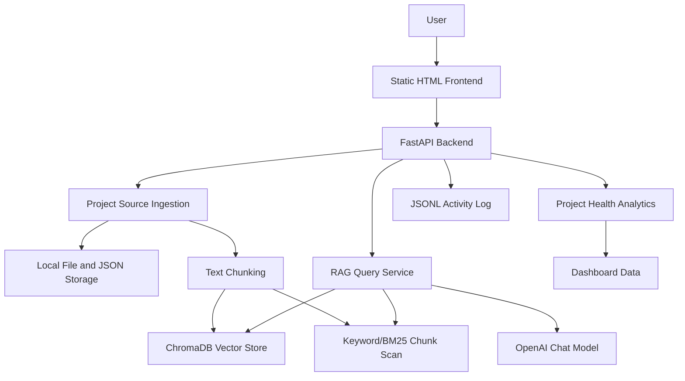

# Base Platform - Project Intelligence & KT Copilot

Base is an early MVP for a company/project intelligence platform.

The long-term goal is to let a company connect project data from tools like Jira, Slack, Teams, GitHub, product analytics, traffic dashboards, database health checks, logs, and internal documents, then ask natural-language questions over that combined context.

In simple terms:

> Company/project data in. Answers, performance metrics, risk signals, and KT out.

The product should help teams understand what is happening in a project, why it is happening, what needs attention, and what a new person needs to know to become productive quickly.

---

## Product Vision

Base is intended to become an AI project brain for engineering, product, operations, and leadership teams.

It should help answer questions like:

- What is this project and how does it work?
- What are the active epics, blockers, and risks?
- Which Jira tickets are delayed, stale, or repeatedly reopened?
- What changed in the last sprint or release?
- Which features are getting the most user engagement?
- Why did traffic, conversion, latency, or uptime change?
- What are the current database health issues?
- What incidents happened recently and what was the root cause?
- Which services, APIs, or teams need attention?
- What should a new engineer, PM, or analyst learn first?
- Generate KT for the payments module, onboarding flow, infra setup, or support process.

The platform combines two kinds of intelligence:

- **Knowledge intelligence:** RAG over documents, tickets, chats, PRs, decisions, incidents, and runbooks.
- **Operational intelligence:** Structured metrics from analytics tools, observability systems, databases, CI/CD, and project management APIs.

RAG is useful for explanations and source-grounded answers. Structured APIs and metrics stores are needed for accurate performance numbers, trends, system health, traffic, usage, and SLA reporting.

---

## Current MVP

This repository currently implements the first slice of that larger idea.

The current app can:

- Create and switch between separate project workspaces.
- Upload PDF, TXT, Markdown, and CSV files.
- Extract text from those files.
- Split the text into searchable chunks.
- Store chunks in ChromaDB with OpenAI embeddings.
- Use hybrid retrieval: semantic vector search plus rg-like keyword/BM25 matching for exact IDs, tickets, PRs, errors, and service names.
- Maintain a local keyword chunk cache and backfill it from saved uploads for older project data.
- Ask AI questions over uploaded documents using RAG, with internet search fallback for general or current questions.
- Return project source citations with relevance scores and clickable web citations when internet search is used.
- Generate project-health metrics from extracted text: risks, blockers, tickets, decisions, source type, health score, and KT readiness signals.
- Detect basic risk signals, anomaly signals, and validation issues.
- Generate an Obsidian-style knowledge graph for each project from uploaded sources and extracted entities.
- Generate an initial KT brief for onboarding, handoff, or operations review.
- Generate NotebookLM-style study artifacts: interactive quizzes, host conversations, audio overview playback scripts, video storyboards, slide deck outlines, flashcards, and infographics over uploaded project files.
- Show a static web UI with project picker, dashboard, agent gallery, connector hub, knowledge graph, chat, KT brief, source library, and activity log views.
- Run demo-ready project agents for risk review, incident review, release notes, handoff briefs, metrics investigation, and source gap analysis.
- Track upload-first connector coverage for Jira, Teams, email, GitHub, Grafana, database health, Confluence, PagerDuty, support, and BI sources.
- Export project intelligence analytics as CSV, Tableau-style JSON, and PowerBI-style JSON.
- Keep a local JSONL activity trail of uploads, queries, KT briefs, deletes, dashboard views, and exports.

Important note: the current implementation is still file-upload based. External connectors for Jira, Slack, GitHub, observability, analytics, and databases are part of the roadmap.

---

## Target Data Sources

Future versions should support connectors for:

- Jira, Linear, Azure Boards, or other ticket systems.
- Slack, Microsoft Teams, or email conversations.
- GitHub, GitLab, Bitbucket, PRs, commits, branches, and releases.
- Product analytics such as Mixpanel, Amplitude, GA4, PostHog, or custom event tables.
- Traffic and performance metrics from tools like Datadog, Grafana, Prometheus, CloudWatch, or New Relic.
- Database health checks, slow query reports, replication status, storage usage, and connection metrics.
- Incident tools like PagerDuty, Opsgenie, Statuspage, or internal incident docs.
- Internal docs from Notion, Confluence, Google Drive, SharePoint, Markdown repos, or PDFs.
- Customer support systems like Zendesk, Intercom, Freshdesk, or CRM notes.

---

## Example Workflows

### New Joiner KT

1. Connect project docs, tickets, PRs, chats, and runbooks.
2. Ask: "Give me KT for this project as a new backend engineer."
3. Base returns architecture overview, key modules, current priorities, known risks, recent changes, owners, and recommended next reading.
4. The answer includes citations back to source tickets, docs, chats, and PRs.

### Project Health Review

1. Connect Jira, GitHub, deployment history, product analytics, and observability metrics.
2. Ask: "How is the project performing this month?"
3. Base returns sprint progress, delivery risks, blocked work, bug trends, deployment frequency, user engagement changes, traffic movement, latency/error trends, and database health.

### Incident or Handoff Summary

1. Ingest incident notes, chat conversations, logs, metrics, and recent code changes.
2. Ask: "What happened, what changed, and what should the next person check?"
3. Base produces a concise handoff with timeline, impact, probable cause, open actions, and linked sources.

---

## Current Architecture


```mermaid
graph TD
  User[User] --> Frontend[Static HTML Frontend]
  Frontend --> API[FastAPI Backend]
  API --> Ingest[Project Source Ingestion]
  Ingest --> Storage[Local File and JSON Storage]
  Ingest --> Chunks[Text Chunking]
  Chunks --> VectorDB[ChromaDB Vector Store]
  Chunks --> Keyword[Keyword/BM25 Chunk Scan]
  API --> RAG[RAG Query Service]
  RAG --> VectorDB
  RAG --> Keyword
  RAG --> OpenAI[OpenAI Chat Model]
  API --> Analytics[Project Health Analytics]
  Analytics --> Dashboard[Dashboard Data]
  API --> ActivityLog[JSONL Activity Log]
```

The MVP is intentionally simple:

- Backend: FastAPI.
- Frontend: single static `frontend/index.html`.
- Vector database: local ChromaDB.
- LLM and embeddings: OpenAI.
- Runtime storage: local files under `backend/data/` and `backend/chroma_db/`.

---

## Project Structure

```text
base-platform/
+-- backend/
|   +-- app/
|   |   +-- main.py              # FastAPI app
|   |   +-- core/config.py       # Settings from .env
|   |   +-- api/
|   |   |   +-- ingest.py        # POST /api/ingest/
|   |   |   +-- query.py         # POST /api/query/
|   |   |   +-- documents.py     # GET/DELETE /api/documents/
|   |   |   +-- analytics.py     # Project dashboard, activity log, exports
|   |   +-- services/
|   |       +-- ingestion.py     # File parsing and chunking
|   |       +-- vector_store.py  # ChromaDB and hybrid retrieval operations
|   |       +-- rag.py           # RAG pipeline
|   |       +-- studio.py        # Quiz and conversation generation
|   |       +-- analytics.py     # Current project-health metrics
|   |       +-- storage.py       # Local document/JSON storage
|   |       +-- audit_log.py     # JSONL audit trail
|   +-- requirements.txt
|   +-- .env.example
+-- frontend/
    +-- index.html               # Single-file UI
    +-- package.json
```

---

## Quick Start

### Prerequisites

- Python 3.9+
- An OpenAI API key

Uploading and querying documents currently uses OpenAI embeddings and chat completions.

### 1. Configure The Backend

```bash
cd backend
python3 -m venv venv
source venv/bin/activate
pip install -r requirements.txt
cp .env.example .env
```

Open `backend/.env` and set:

```bash
OPENAI_API_KEY=sk-your-key-here
ANTHROPIC_API_KEY=optional-placeholder
```

`OPENAI_API_KEY` is required for the current app. `ANTHROPIC_API_KEY` is present as a placeholder only; the current code does not call Anthropic.

### 2. Start The Backend API

From the `backend/` directory:

```bash
source venv/bin/activate
python3 -m uvicorn app.main:app --reload --host 0.0.0.0 --port 8000
```

Useful URLs:

- Backend: http://localhost:8000
- Swagger docs: http://localhost:8000/docs
- Health check: http://localhost:8000/health

### 3. Start The Frontend

Open a second terminal:

```bash
cd frontend
python3 -m http.server 3000
```

Frontend URL: http://localhost:3000

You can also open `frontend/index.html` directly in a browser. When served on port `3000` or opened as a local file, the frontend calls the backend at `http://localhost:8000`.

---

## Using The MVP

1. Visit http://localhost:3000.
2. Create or open a project from the project dashboard.
3. Upload PDF, TXT, Markdown, or CSV files inside that project.
4. Review the extracted dashboard metrics for the selected project.
5. Open Agents to run focused project workflows such as risk review, incident review, release notes, or source gap analysis.
6. Open Connectors to inspect which project data sources are indexed and which uploads are still missing.
7. Open the Knowledge Graph view to inspect source, ticket, PR, incident, risk, blocker, decision, and metric connections. Click nodes for topic details or edges for connection evidence.
8. Ask questions in the AI chat.
9. Generate a KT brief for onboarding, handoff, or operations review.
10. Go back to the project dashboard to switch projects.
11. Export extracted analytics with `Export CSV`, `Tableau JSON`, or `PowerBI JSON`.

Because this is still the document-focused MVP, use project docs, tickets exported as CSV, meeting notes, incident summaries, architecture docs, runbooks, or chat exports as input files.

---

## API Reference

| Method | Endpoint | Description |
|--------|----------|-------------|
| GET | `/api/projects/` | List project workspaces with dashboard summaries |
| POST | `/api/projects/` | Create a project workspace |
| GET | `/api/projects/{id}` | Return one project workspace summary |
| POST | `/api/ingest/` | Upload and index a document |
| POST | `/api/query/` | Ask a question over indexed documents with optional internet fallback |
| POST | `/api/query/stream` | Ask a question with backend progress events, optional internet fallback, and final answer |
| POST | `/api/query/kt` | Generate a source-grounded KT brief |
| POST | `/api/query/kt/stream` | Generate a KT brief with backend progress events and final answer |
| POST | `/api/query/quiz` | Generate an interactive source-grounded quiz from uploaded project files |
| POST | `/api/query/conversation` | Generate a NotebookLM-style source conversation transcript from uploaded files |
| POST | `/api/query/artifact` | Generate audio overview, video overview, slide deck, flashcards, or infographic artifacts |
| GET | `/api/documents/` | List indexed documents |
| DELETE | `/api/documents/{id}` | Delete a document and its chunks |
| GET | `/api/analytics/dashboard` | Return project-health metrics, charts, issues, and recent events |
| GET | `/api/analytics/audit-log` | Return recent activity records |
| GET | `/api/analytics/insights` | Return generated insight cards |
| GET | `/api/analytics/anomalies` | Return anomaly signals |
| GET | `/api/analytics/knowledge-graph` | Return project graph nodes and edges |
| GET | `/api/analytics/export.csv` | Export extracted analytics as CSV |
| GET | `/api/analytics/export.tableau.json` | Export Tableau-friendly JSON |
| GET | `/api/analytics/export.powerbi.json` | Export PowerBI-friendly JSON |

Project-scoped endpoints such as ingestion, query, documents, and analytics accept the `x-tenant-id` header. The frontend sets it to the selected `project_id`.

`POST /api/query/` also accepts a `language` field:

- `en` for English
- `es` for Spanish
- `fr` for French
- `de` for German
- `hi` for Hindi

---

## Environment Config

```bash
OPENAI_API_KEY=sk-...
ANTHROPIC_API_KEY=
LLM_MODEL=gpt-4o
EMBEDDING_MODEL=text-embedding-3-small
WEB_SEARCH_ENABLED=true
WEB_SEARCH_MODEL=gpt-4o-mini
WEB_SEARCH_TOOL=web_search
WEB_SEARCH_CONTEXT_SIZE=medium
WEB_SEARCH_MIN_RELEVANCE=0.2
CHROMA_PERSIST_DIR=./chroma_db
DATA_DIR=./data
DOCUMENT_STORAGE_DIR=./data/documents
AUDIT_LOG_PATH=./data/audit_log.jsonl
CHUNK_SIZE=500
CHUNK_OVERLAP=50
RETRIEVAL_K=5
```

---

## MVP Limitations

The current app is useful as a prototype, but it is not the full project intelligence platform yet.

Not implemented yet:

- Jira, Slack, GitHub, analytics, observability, or database connectors.
- Authentication, SSO, RBAC, and user management.
- True metric computation from live systems.
- Scheduled sync jobs.
- Background ingestion workers.
- OCR for scanned documents or images.
- Enterprise-grade tenant isolation.
- Production secrets management.
- Real Tableau/PowerBI push integration.
- Deep role-specific KT templates beyond the initial KT brief generator.

The current analytics are heuristic and text-based. For production performance metrics, Base should query structured sources directly instead of asking the LLM to infer numbers from text.

---

## Roadmap

### Phase 1 - Harden Current MVP

- Improve project-health scoring with better source-specific extraction.
- Add sample project datasets for demos.
- Add richer KT templates by role: engineer, PM, SRE, support, and manager.
- Add tests around ingestion, analytics, exports, and KT endpoint behavior.

### Phase 2 - Real Connectors

- Add Jira or Linear connector.
- Add GitHub connector for PRs, commits, releases, and ownership.
- Add Slack or Teams connector for decisions and discussions.
- Add product analytics connector for usage and engagement.
- Add observability connector for latency, errors, traffic, uptime, and DB health.

### Phase 3 - Metrics Layer

- Store normalized project entities: tickets, users, teams, services, deployments, incidents, metrics, docs, and decisions.
- Add time-series queries for traffic, engagement, health, and performance metrics.
- Build reliable project health scoring from structured data.
- Add anomaly detection over real metrics.

### Phase 4 - Enterprise Readiness

- Authentication and SSO.
- RBAC and tenant isolation.
- Background sync workers.
- Secure secrets storage.
- Audit-ready logs.
- Deployment options for cloud, VPC, or on-prem environments.

---

## Deployment

Current lightweight deployment target:

- Backend: Railway, Render, Fly.io, or any Python web host.
- Frontend: Vercel, Netlify, static hosting, or the same backend domain.

If deploying the frontend on Vercel with the included rewrite, replace the placeholder backend URL in `vercel.json`. If deploying without a rewrite/proxy, update `API_BASE` in `frontend/index.html`.

---

## Troubleshooting

- If `uvicorn` is not found, run `python3 -m uvicorn app.main:app --reload --host 0.0.0.0 --port 8000` from the `backend/` directory.
- If uploads fail, confirm `OPENAI_API_KEY` is set in `backend/.env` and restart the backend.
- If ChromaDB fails with a NumPy 2.x error, reinstall dependencies with `pip install -r backend/requirements.txt`; this project pins `numpy<2`.
- If OpenAI or `httpx` fails with a `proxies` argument error, reinstall dependencies; this project pins `httpx<0.28`.
