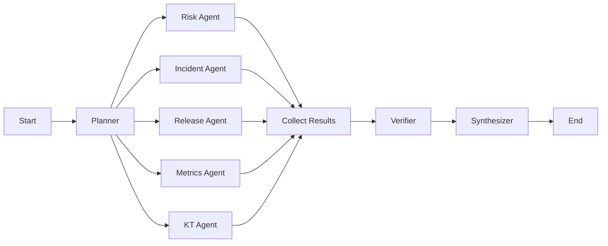
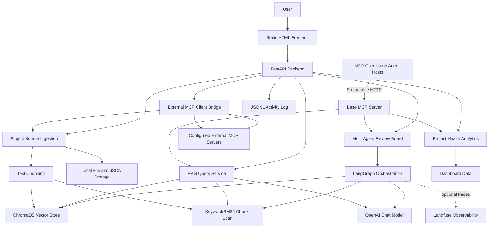
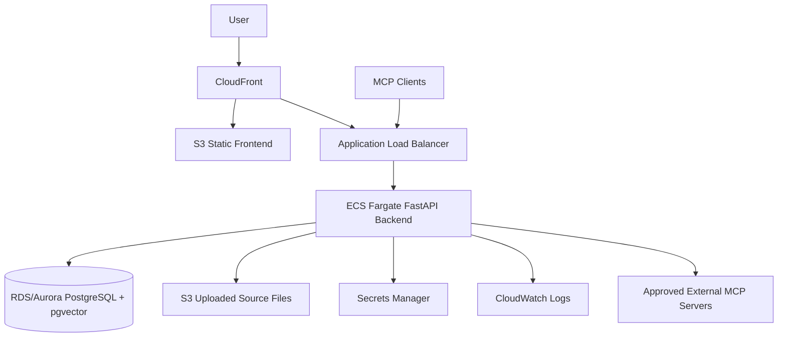

# Base Platform - Project Intelligence & KT Copilot

Base is an early MVP for a company/project intelligence platform.

The long-term goal is to let a company connect project data from tools like Jira, Slack, Teams, GitHub, product analytics, traffic dashboards, database health checks, logs, and internal documents, then ask natural-language questions over that combined context.

In simple terms:

> Company/project data in. Answers, performance metrics, risk signals, and KT out.

The product should help teams understand what is happening in a project, why it is happening, what needs attention, and what a new person needs to know to become productive quickly.

---

## Product Vision

Base is intended to become an AI project brain for engineering, product, operations, and leadership teams.

It should help answer questions like:

- What is this project and how does it work?
- What are the active epics, blockers, and risks?
- Which Jira tickets are delayed, stale, or repeatedly reopened?
- What changed in the last sprint or release?
- Which features are getting the most user engagement?
- Why did traffic, conversion, latency, or uptime change?
- What are the current database health issues?
- What incidents happened recently and what was the root cause?
- Which services, APIs, or teams need attention?
- What should a new engineer, PM, or analyst learn first?
- Generate KT for the payments module, onboarding flow, infra setup, or support process.

The platform combines two kinds of intelligence:

- **Knowledge intelligence:** RAG over documents, tickets, chats, PRs, decisions, incidents, and runbooks.
- **Operational intelligence:** Structured metrics from analytics tools, observability systems, databases, CI/CD, and project management APIs.

RAG is useful for explanations and source-grounded answers. Structured APIs and metrics stores are needed for accurate performance numbers, trends, system health, traffic, usage, and SLA reporting.

---

## Current MVP

This repository currently implements the first slice of that larger idea.

The current app can:

- Create and switch between separate project workspaces.
- Upload PDF, TXT, Markdown, and CSV files.
- Extract text from those files.
- Split the text into searchable chunks.
- Store chunks in ChromaDB with OpenAI embeddings.
- Use hybrid retrieval: semantic vector search plus rg-like keyword/BM25 matching for exact IDs, tickets, PRs, errors, and service names.
- Maintain a local keyword chunk cache and backfill it from saved uploads for older project data.
- Ask AI questions over uploaded documents using RAG, with internet search fallback for general or current questions.
- Return project source citations with relevance scores and clickable web citations when internet search is used.
- Generate project-health metrics from extracted text: risks, blockers, tickets, decisions, source type, health score, and KT readiness signals.
- Detect basic risk signals, anomaly signals, and validation issues.
- Generate an Obsidian-style knowledge graph for each project from uploaded sources and extracted entities.
- Generate an initial KT brief for onboarding, handoff, or operations review.
- Generate NotebookLM-style study artifacts: interactive quizzes, host conversations, audio overview playback scripts, video storyboards, slide deck outlines, flashcards, and infographics over uploaded project files.
- Show a static web UI with project picker, dashboard, agent gallery, connector hub, knowledge graph, chat, KT brief, source library, and activity log views.
- Run demo-ready project agents for risk review, incident review, release notes, handoff briefs, metrics investigation, and source gap analysis.
- Run a LangGraph-based multi-agent Project Review Board that coordinates planner, source retriever, risk, incident, release, metrics, KT, verifier, and synthesizer agents into one source-grounded project review, with optional Langfuse tracing.
- Connect and sync project data from live APIs or credential-based connectors, then index the fetched records through the same RAG path as uploaded files.
- Track connector coverage for Jira, Linear, Azure Boards, Slack, Teams, email, GitHub, GitLab, Bitbucket, product analytics, observability, database health, incidents, docs, support, and BI sources.
- Expose project catalogs, source lists, hybrid search, dashboards, knowledge graphs, RAG answers, and multi-agent reviews through a project-scoped MCP server.
- Discover tools and resources on configured external MCP servers, call them through the Base API, and import their output into a selected project's RAG index.
- Export project intelligence analytics as CSV, Tableau-style JSON, and PowerBI-style JSON.
- Keep a local JSONL activity trail of uploads, queries, KT briefs, deletes, dashboard views, exports, and MCP activity.

Important note: live connectors are demo-grade. They support manual credential/OAuth setup and on-demand sync, but production use should move secrets to AWS Secrets Manager, add permission-aware retrieval, scheduled refresh, and background ingestion workers.

---

## Target Data Sources

The connector hub defines live or upload-fallback paths for:

- Jira, Linear, Azure Boards, or other ticket systems.
- Slack, Microsoft Teams, or email conversations.
- GitHub, GitLab, Bitbucket, PRs, commits, branches, and releases.
- Product analytics such as Mixpanel, Amplitude, GA4, PostHog, or custom event tables.
- Traffic and performance metrics from tools like Datadog, Grafana, Prometheus, CloudWatch, or New Relic.
- Database health checks, slow query reports, replication status, storage usage, and connection metrics.
- Incident tools like PagerDuty, Opsgenie, Statuspage, or internal incident docs.
- Internal docs from Notion, Confluence, Google Drive, SharePoint, Markdown repos, or PDFs.
- Customer support systems like Zendesk, Intercom, Freshdesk, or CRM notes.

OAuth support is currently scaffolded for Microsoft Graph and Atlassian. API-token connectors can be configured directly in the Connector Hub per project workspace.

---

## Example Workflows

### New Joiner KT

1. Connect project docs, tickets, PRs, chats, and runbooks.
2. Ask: "Give me KT for this project as a new backend engineer."
3. Base returns architecture overview, key modules, current priorities, known risks, recent changes, owners, and recommended next reading.
4. The answer includes citations back to source tickets, docs, chats, and PRs.

### Project Health Review

1. Connect Jira, GitHub, deployment history, product analytics, and observability metrics.
2. Ask: "How is the project performing this month?"
3. Base returns sprint progress, delivery risks, blocked work, bug trends, deployment frequency, user engagement changes, traffic movement, latency/error trends, and database health.

### Multi-Agent Project Review Board

1. Connect or upload project sources from Jira, GitHub, Teams, Confluence, Grafana, database health exports, PagerDuty, and release notes.
2. Open **Agents** and run **Project Review Board**, or use the dashboard's **Run Multi-Agent Review** action.
3. Base streams each stage as it runs: planner, source retriever, parallel specialist agents, verifier, and synthesizer.
4. Each specialist retrieves its own evidence in parallel, produces structured findings, and returns confidence and missing-evidence notes.
5. The verifier checks for weak or unsupported claims before the synthesizer creates the final project review.
6. The final answer includes source citations, chunks reviewed, token usage, and a compact specialist-agent summary in the chat.

### Incident or Handoff Summary

1. Ingest incident notes, chat conversations, logs, metrics, and recent code changes.
2. Ask: "What happened, what changed, and what should the next person check?"
3. Base produces a concise handoff with timeline, impact, probable cause, open actions, and linked sources.

---

## Multi-Agent Orchestration

Base includes a source-grounded multi-agent workflow implemented as a LangGraph `StateGraph` in `backend/app/services/multi_agent.py`. LangChain's `ChatOpenAI` integration handles model calls and schema-validated specialist output, while optional Langfuse callbacks trace graph nodes, retrieval prompts, model latency, token usage, and failures.

The current orchestration is intentionally pragmatic for an MVP:

- **Planner stage:** decomposes the review into specialist scopes and streams the plan to the UI.
- **Source Retriever stage:** prepares specialist-specific retrieval queries.
- **Risk Analyst Agent:** reviews blockers, stale work, unresolved owners, delivery risks, and next actions.
- **Incident Analyst Agent:** reviews incidents, PagerDuty-style evidence, impact, probable causes, and prevention actions.
- **Release and Code Agent:** reviews PRs, commits, branches, releases, rollout notes, and architecture/code-change evidence.
- **Metrics and Reliability Agent:** reviews Grafana-style metrics, traffic, latency, error rates, uptime, database health, and reliability signals.
- **KT and Onboarding Agent:** converts project evidence into first-week learning priorities and handoff guidance.
- **Verifier Agent:** checks whether specialist findings are supported by the retrieved source snippets and highlights evidence gaps.
- **Synthesizer Agent:** combines the specialist outputs into one final project review.

LangGraph fans out from the planner to all five specialist nodes and executes them concurrently. Their state updates are collected in a deterministic order before the verifier and synthesizer run sequentially. Planner, retriever, and collector are deterministic orchestration stages rather than extra model calls.


```mermaid
graph LR
  Start --> Planner
  Planner --> Risk[Risk Agent]
  Planner --> Incident[Incident Agent]
  Planner --> Release[Release Agent]
  Planner --> Metrics[Metrics Agent]
  Planner --> KT[KT Agent]
  Risk --> Collect[Collect Results]
  Incident --> Collect
  Release --> Collect
  Metrics --> Collect
  KT --> Collect
  Collect --> Verifier
  Verifier --> Synthesizer
  Synthesizer --> End
```

The response is returned as:

- `answer`: final synthesized review.
- `sources`: deduplicated source citations across all specialists.
- `agents`: per-agent summaries, findings, risks, actions, confidence, missing evidence, and chunks used.
- `verifier`: unsupported claims, evidence gaps, and confidence.
- `answer_mode`: `multi_agent`.

The streaming endpoint emits progress events that the frontend renders as the animated "agent thinking" card.

## MCP Interoperability

For a complete local interview demonstration with an open-source enterprise dummy server, registry UI, Docker Compose stack, and automated read/write/import proof, see [`docs/MCP_INTERVIEW_DEMO.md`](docs/MCP_INTERVIEW_DEMO.md).

Base uses the official [Model Context Protocol Python SDK](https://github.com/modelcontextprotocol/python-sdk) in both directions:

- **Base as an MCP server:** MCP clients can access approved Base project data and actions through Streamable HTTP at `/mcp` or through a local stdio process.
- **Base as an MCP client bridge:** the FastAPI application can discover configured external MCP servers, call their tools, read their resources, and optionally index the returned text into a Base project.

MCP follows a client/server model. An AI application, IDE, or another service that implements an MCP client can connect to Base. A standalone MCP server does not automatically call another MCP server unless it also contains client behavior like the bridge implemented here.

### Base MCP Server

The HTTP MCP endpoint is mounted inside the existing FastAPI process:

```text
http://localhost:8000/mcp
```

It uses stateless Streamable HTTP with JSON responses so the same container can serve both REST and MCP traffic. Configure these values in `backend/.env` or the deployment environment:

```bash
# Required outside trusted local development.
MCP_API_KEY=replace-with-a-long-random-secret

# Optional comma-separated allowlist. Empty means every Base project is exposed.
MCP_EXPOSED_PROJECT_IDS=project-atlas-a1b2c3d4,payments-e5f6a7b8

# DNS-rebinding protection. Add the backend origin host and public origin in production.
MCP_ALLOWED_HOSTS=127.0.0.1:*,localhost:*,[::1]:*
MCP_ALLOWED_ORIGINS=http://127.0.0.1:*,http://localhost:*,http://[::1]:*
```

HTTP clients can send the secret as either `Authorization: Bearer <key>` or `X-MCP-API-Key: <key>`. `MCP_API_KEY` may be empty for local-only testing, but do not expose an unauthenticated `/mcp` endpoint to the internet.

Base fails closed in production: when `ENVIRONMENT=production` and `MCP_API_KEY` is empty, `/mcp` returns `503` instead of exposing project data. Create the secret in your deployment secret manager and inject it into the backend container before enabling remote MCP access.

The server exposes these MCP tools:

| Tool | Purpose |
|------|---------|
| `base_list_projects` | List project workspaces allowed by `MCP_EXPOSED_PROJECT_IDS` |
| `base_list_sources` | List indexed sources for one project |
| `base_search_project` | Run semantic plus keyword/BM25 search and return matching source chunks |
| `base_get_dashboard` | Return project KPIs, trends, risks, anomalies, and validation issues |
| `base_get_knowledge_graph` | Return project graph nodes, edges, and evidence metadata |
| `base_ask_project` | Run source-grounded RAG; web search is off unless explicitly enabled |
| `base_run_project_review` | Run the LangGraph multi-agent Project Review Board |

It also exposes these resources and resource templates:

| Resource URI | Purpose |
|--------------|---------|
| `base://projects` | Catalog of exposed Base projects |
| `base://projects/{project_id}/summary` | One project summary |
| `base://projects/{project_id}/sources` | Indexed source catalog |
| `base://projects/{project_id}/knowledge-graph` | Knowledge graph JSON |

To inspect the HTTP server, start Base and then run the official MCP Inspector:

```bash
npx -y @modelcontextprotocol/inspector
```

Connect the Inspector to `http://localhost:8000/mcp` and add `Authorization: Bearer <MCP_API_KEY>` when authentication is enabled.

For a local stdio client, run Base from the backend directory:

```bash
cd backend
source venv/bin/activate
python -m app.mcp_server
```

The stdio transport does not pass through the HTTP API-key middleware, but `MCP_EXPOSED_PROJECT_IDS` still applies. Only launch it from a trusted local client process.

### External MCP Servers

The Connector Hub includes a project-scoped registry for two official remote providers:

- **GitHub MCP:** `https://api.githubcopilot.com/mcp/x/all/readonly` for repositories, source code, commits, issues, pull requests, and Actions.
- **Atlassian Rovo MCP:** `https://mcp.atlassian.com/v1/mcp` for Jira, Confluence, and Compass.

Both providers support token registration. The registry can register, authorize, test, discover capabilities, import results into RAG, and disconnect a provider. Its reusable OAuth authorization-code implementation includes state validation and PKCE. Enable OAuth with provider application credentials:

```bash
GITHUB_OAUTH_CLIENT_ID=
GITHUB_OAUTH_CLIENT_SECRET=
GITHUB_OAUTH_REDIRECT_URI=http://localhost:8000/api/mcp/oauth/github/callback
ATLASSIAN_CLIENT_ID=
ATLASSIAN_CLIENT_SECRET=
ATLASSIAN_MCP_REDIRECT_URI=http://localhost:8000/api/mcp/oauth/atlassian/callback
```

Register the matching callback URL in the GitHub OAuth App or Atlassian developer console. In AWS, use the public application origin instead of `localhost:8000`.

External MCP URLs are deployment configuration, not arbitrary request parameters. This prevents the REST API from becoming an unrestricted server-side request endpoint. Configure a JSON array in `MCP_EXTERNAL_SERVERS_JSON`:

```bash
export ENGINEERING_MCP_TOKEN=replace-with-external-server-token

MCP_EXTERNAL_SERVERS_JSON=[{"name":"engineering","url":"https://mcp.example.com/mcp","description":"Engineering docs and release data","bearer_token_env":"ENGINEERING_MCP_TOKEN","project_ids":["project-atlas-a1b2c3d4"]}]
MCP_REQUEST_TIMEOUT_SECONDS=30
MCP_MAX_IMPORT_CHARS=200000
```

Each external-server object supports:

- `name`: unique letters/numbers/underscore/hyphen identifier used in API routes.
- `url`: absolute `http://` or `https://` Streamable HTTP MCP URL.
- `description`: optional display text.
- `project_ids`: optional Base project allowlist; omit or use an empty list for every project.
- `bearer_token_env`: optional process environment variable containing a bearer token.
- `api_key_env` and `api_key_header`: optional process environment variable and header name for API-key authentication.

Secret values are never returned by the Base API. Variables named by `bearer_token_env` or `api_key_env` must exist in the process environment, such as an exported shell variable, container secret, or AWS Secrets Manager injected environment variable. Restart Base after changing the server catalog.

Discover one configured server:

```bash
curl http://localhost:8000/api/mcp/servers/engineering/capabilities \
  -H "x-tenant-id: project-atlas-a1b2c3d4"
```

Call an external tool without importing its result:

```bash
curl -X POST http://localhost:8000/api/mcp/servers/engineering/tools/search_docs \
  -H "Content-Type: application/json" \
  -H "x-tenant-id: project-atlas-a1b2c3d4" \
  -d '{"arguments":{"query":"checkout rollback procedure"}}'
```

Import a resource into the selected Base project's normal ingestion and RAG path:

```bash
curl -X POST http://localhost:8000/api/mcp/servers/engineering/import \
  -H "Content-Type: application/json" \
  -H "x-tenant-id: project-atlas-a1b2c3d4" \
  -d '{"source_type":"resource","resource_uri":"docs://runbooks/checkout"}'
```

For a tool import, use `source_type: "tool"`, provide `tool_name`, and place the tool arguments in `arguments`. Imported MCP responses are saved as Markdown sources, analyzed, chunked, added to semantic and keyword indexes, connected into the knowledge graph, and recorded in the audit log.

## Current Architecture


```mermaid
graph TD
  User[User] --> Frontend[Static HTML Frontend]
  Frontend --> API[FastAPI Backend]
  MCPClient[MCP Clients and Agent Hosts] -->|Streamable HTTP| BaseMCP[Base MCP Server]
  BaseMCP --> RAG
  BaseMCP --> Analytics
  BaseMCP --> ReviewBoard
  API --> MCPBridge[External MCP Client Bridge]
  MCPBridge --> ExternalMCP[Configured External MCP Servers]
  ExternalMCP --> MCPBridge
  MCPBridge --> Ingest
  API --> Ingest[Project Source Ingestion]
  Ingest --> Storage[Local File and JSON Storage]
  Ingest --> Chunks[Text Chunking]
  Chunks --> VectorDB[ChromaDB Vector Store]
  Chunks --> Keyword[Keyword/BM25 Chunk Scan]
  API --> RAG[RAG Query Service]
  RAG --> VectorDB
  RAG --> Keyword
  RAG --> OpenAI[OpenAI Chat Model]
  API --> ReviewBoard[Multi-Agent Review Board]
  ReviewBoard --> LangGraph[LangGraph Orchestration]
  LangGraph --> VectorDB
  LangGraph --> Keyword
  LangGraph --> OpenAI
  LangGraph -. optional traces .-> Langfuse[Langfuse Observability]
  API --> Analytics[Project Health Analytics]
  Analytics --> Dashboard[Dashboard Data]
  API --> ActivityLog[JSONL Activity Log]
```

The MVP is intentionally simple:

- Backend: FastAPI.
- Frontend: single static `frontend/index.html`.
- Vector database: local ChromaDB.
- LLM and embeddings: OpenAI.
- Runtime storage: local files under `backend/data/` and `backend/chroma_db/`.

## Production AWS Path

The app now supports production-oriented storage backends through environment flags while keeping the local MVP defaults.

### Temporary Recruiter Demo

The current four-day AWS deployment is intentionally temporary:

```text
Public URL:       https://d2llye5km5il24.cloudfront.net/
AWS Region:      eu-central-1
AWS budget:      USD 20 custom period (2026-07-13T00:00:00Z to 2026-07-16T21:00:00Z)
Teardown starts: 2026-07-16 23:00 Europe/Berlin (2026-07-16T21:00:00Z)
```

AWS EventBridge Scheduler invokes the idempotent `base-demo-teardown` Lambda at the deadline, then repeats at `21:35Z` and `22:15Z` to finish asynchronous CloudFront, RDS, managed database-secret, networking, and IAM cleanup. Each one-time schedule uses `ActionAfterCompletion=DELETE`. A 100% actual-spend budget notification also reaches the teardown Lambda through SNS topic `base-budget-stop`. The manual backup is `.github/workflows/teardown-aws.yml`.

The AWS Budget is an expiring cost monitor, not a hard spending lock, and AWS cost data can arrive late. The budget notification is an additional stop signal; the scheduled teardown remains the authoritative control that stops and removes billable application infrastructure at the deadline.

The public application intentionally has no user login for this short recruiter demo. The machine-facing `/mcp` endpoint remains protected by an independently generated `MCP_API_KEY` stored in AWS Secrets Manager. OpenAI-backed public actions can consume separate OpenAI API credit, so the AWS budget does not cap model-provider spending.

Recommended AWS deployment:


```mermaid
graph TD
  User[User] --> CloudFront[CloudFront]
  CloudFront --> S3Frontend[S3 Static Frontend]
  CloudFront --> ALB[Application Load Balancer]
  MCPClients[MCP Clients] --> ALB
  ALB --> ECS[ECS Fargate FastAPI Backend]
  ECS --> RDS[(RDS/Aurora PostgreSQL + pgvector)]
  ECS --> S3Docs[S3 Uploaded Source Files]
  ECS --> Secrets[Secrets Manager]
  ECS --> Logs[CloudWatch Logs]
  ECS --> ExternalMCP[Approved External MCP Servers]
```

Production backend settings:

```bash
ENVIRONMENT=production
METADATA_BACKEND=postgres
DOCUMENT_STORAGE_BACKEND=s3
VECTOR_BACKEND=pgvector
DATABASE_URL=postgresql://...
S3_BUCKET=your-private-upload-bucket
S3_PREFIX=base
AWS_REGION=us-east-1
CORS_ORIGINS=https://yourdomain.com
OPENAI_API_KEY=sk-...
MCP_API_KEY=long-random-production-secret
MCP_EXPOSED_PROJECT_IDS=approved-project-id
MCP_ALLOWED_HOSTS=your-alb.example.com,yourdomain.com
MCP_ALLOWED_ORIGINS=https://yourdomain.com
MCP_EXTERNAL_SERVERS_JSON=[]
```

Store `MCP_API_KEY` in AWS Secrets Manager and inject it through the ECS task definition in the same way as `OPENAI_API_KEY`; do not place the actual value in the task-definition JSON or source control. Until that secret is injected, the production `/mcp` endpoint deliberately remains unavailable.

With those settings:

- Project metadata, document analyses, keyword cache, and audit events are stored in PostgreSQL instead of local JSON/JSONL files.
- Uploaded source files are stored in S3 instead of `backend/data/documents`.
- Semantic retrieval stores embeddings in PostgreSQL `pgvector` instead of local ChromaDB.
- The container remains stateless, so ECS Fargate can restart or scale tasks safely.

Deployment scaffolding:

- `Dockerfile` builds the production backend container.
- `.github/workflows/ci.yml` runs backend compile checks and container build.
- `.github/workflows/deploy-aws.yml` builds/pushes to ECR, deploys ECS, syncs the frontend to S3, and invalidates CloudFront.
- `.github/workflows/teardown-aws.yml` manually invokes the same idempotent teardown Lambda used by the deadline scheduler.
- `infra/aws/ecs-task-definition.json` is the ECS task definition template.
- `infra/aws/demo_teardown.py` contains the repeat-safe AWS cleanup function for temporary demos.
- `infra/aws/README.md` lists required AWS resources and repository variables.

---

## Project Structure

```text
base-platform/
+-- backend/
|   +-- app/
|   |   +-- main.py              # FastAPI app
|   |   +-- mcp_server.py        # Base resources/tools over stdio or Streamable HTTP MCP
|   |   +-- core/config.py       # Settings from .env
|   |   +-- api/
|   |   |   +-- ingest.py        # POST /api/ingest/
|   |   |   +-- query.py         # POST /api/query/
|   |   |   +-- documents.py     # GET/DELETE /api/documents/
|   |   |   +-- analytics.py     # Project dashboard, activity log, exports
|   |   |   +-- connectors.py    # Connector catalog, credentials, OAuth, and sync
|   |   |   +-- mcp_bridge.py    # External MCP discovery, call, read, and import REST endpoints
|   |   +-- services/
|   |       +-- ingestion.py     # File parsing and chunking
|   |       +-- vector_store.py  # ChromaDB and hybrid retrieval operations
|   |       +-- rag.py           # RAG pipeline
|   |       +-- multi_agent.py   # Project Review Board orchestration
|   |       +-- studio.py        # Quiz and conversation generation
|   |       +-- analytics.py     # Current project-health metrics
|   |       +-- connectors.py    # Live connector adapters and state management
|   |       +-- connector_ingestion.py # Index connector output like uploaded sources
|   |       +-- mcp_client.py    # Streamable HTTP client for configured external MCP servers
|   |       +-- storage.py       # Local document/JSON storage
|   |       +-- database.py      # Optional PostgreSQL metadata and pgvector schema
|   |       +-- audit_log.py     # JSONL audit trail
|   +-- requirements.txt
|   +-- .env.example
+-- frontend/
    +-- index.html               # Single-file UI
    +-- package.json
```

---

## Quick Start

### Prerequisites

- Python 3.10+
- An OpenAI API key

Uploading and querying documents currently uses OpenAI embeddings and chat completions.

### 1. Configure The Backend

```bash
cd backend
python3 -m venv venv
source venv/bin/activate
pip install -r requirements.txt
cp .env.example .env
```

Open `backend/.env` and set:

```bash
OPENAI_API_KEY=sk-your-key-here
ANTHROPIC_API_KEY=optional-placeholder
MCP_API_KEY=local-mcp-secret
MCP_EXPOSED_PROJECT_IDS=
MCP_ALLOWED_HOSTS=127.0.0.1:*,localhost:*,[::1]:*
MCP_ALLOWED_ORIGINS=http://127.0.0.1:*,http://localhost:*,http://[::1]:*
MCP_EXTERNAL_SERVERS_JSON=[]
```

`OPENAI_API_KEY` is required for the current app. `ANTHROPIC_API_KEY` is present as a placeholder only; the current code does not call Anthropic.

To trace the multi-agent graph in Langfuse, create a Langfuse project and optionally add:

```bash
LANGFUSE_PUBLIC_KEY=pk-lf-...
LANGFUSE_SECRET_KEY=sk-lf-...
LANGFUSE_BASE_URL=https://cloud.langfuse.com
LANGFUSE_TRACING_ENVIRONMENT=local
```

Tracing stays disabled when either Langfuse key is empty.

When tracing is enabled, retrieved project excerpts can appear in model inputs and outputs sent to the configured Langfuse host. Use an approved Langfuse deployment and retention policy before enabling it for sensitive company data.

### 2. Start The Backend API

From the `backend/` directory:

```bash
source venv/bin/activate
python3 -m uvicorn app.main:app --reload --host 0.0.0.0 --port 8000
```

Useful URLs:

- Backend: http://localhost:8000
- Swagger docs: http://localhost:8000/docs
- Health check: http://localhost:8000/health
- MCP status: http://localhost:8000/api/mcp/status
- MCP Streamable HTTP endpoint: http://localhost:8000/mcp

### 3. Start The Frontend

Open a second terminal:

```bash
cd frontend
python3 -m http.server 3000
```

Frontend URL: http://localhost:3000

You can also open `frontend/index.html` directly in a browser. When served on port `3000` or opened as a local file, the frontend calls the backend at `http://localhost:8000`.

---

## Using The MVP

1. Visit http://localhost:3000.
2. Create or open a project from the project dashboard.
3. Upload PDF, TXT, Markdown, or CSV files inside that project.
4. Review the extracted dashboard metrics for the selected project.
5. Open Agents to run the multi-agent Project Review Board or focused project workflows such as risk review, incident review, release notes, or source gap analysis.
6. Open Connectors to inspect which project data sources are indexed and which uploads are still missing.
7. Connect an MCP client to `/mcp`, or discover/import an approved external MCP server through `/api/mcp`.
8. Open the Knowledge Graph view to inspect source, ticket, PR, incident, risk, blocker, decision, and metric connections. Click nodes for topic details or edges for connection evidence.
9. Ask questions in the AI chat.
10. Generate a KT brief for onboarding, handoff, or operations review.
11. Go back to the project dashboard to switch projects.
12. Export extracted analytics with `Export CSV`, `Tableau JSON`, or `PowerBI JSON`.

Because this is still the document-focused MVP, use project docs, tickets exported as CSV, meeting notes, incident summaries, architecture docs, runbooks, or chat exports as input files.

---

## API Reference

| Method | Endpoint | Description |
|--------|----------|-------------|
| GET | `/api/projects/` | List project workspaces with dashboard summaries |
| POST | `/api/projects/` | Create a project workspace |
| GET | `/api/projects/{id}` | Return one project workspace summary |
| DELETE | `/api/projects/{id}` | Permanently delete a project and its documents, vectors, connector state, and audit data |
| POST | `/api/ingest/` | Upload and index a document |
| POST | `/api/query/` | Ask a question over indexed documents with optional internet fallback |
| POST | `/api/query/stream` | Ask a question with backend progress events, optional internet fallback, and final answer |
| POST | `/api/query/multi-agent-review` | Run the Project Review Board and return specialist-agent findings plus final synthesis |
| POST | `/api/query/multi-agent-review/stream` | Run the Project Review Board with streamed planner, specialist, verifier, and synthesizer progress |
| POST | `/api/query/kt` | Generate a source-grounded KT brief |
| POST | `/api/query/kt/stream` | Generate a KT brief with backend progress events and final answer |
| POST | `/api/query/quiz` | Generate an interactive source-grounded quiz from uploaded project files |
| POST | `/api/query/conversation` | Generate a NotebookLM-style source conversation transcript from uploaded files |
| POST | `/api/query/artifact` | Generate audio overview, video overview, slide deck, flashcards, or infographic artifacts |
| GET | `/api/documents/` | List indexed documents |
| DELETE | `/api/documents/{id}` | Delete a document and its chunks |
| GET | `/api/analytics/dashboard` | Return project-health metrics, charts, issues, and recent events |
| GET | `/api/analytics/audit-log` | Return recent activity records |
| GET | `/api/analytics/insights` | Return generated insight cards |
| GET | `/api/analytics/anomalies` | Return anomaly signals |
| GET | `/api/analytics/knowledge-graph` | Return project graph nodes and edges |
| GET | `/api/analytics/export.csv` | Export extracted analytics as CSV |
| GET | `/api/analytics/export.tableau.json` | Export Tableau-friendly JSON |
| GET | `/api/analytics/export.powerbi.json` | Export PowerBI-friendly JSON |
| MCP | `/mcp` | Stateless Streamable HTTP MCP endpoint for Base resources and tools |
| GET | `/api/mcp/status` | Show inbound MCP settings and configured external servers without secrets |
| GET | `/api/mcp/registry` | Return the project-filtered, allowlisted external MCP server registry |
| POST | `/api/mcp/registry` | Register an official GitHub or Atlassian provider for the selected project |
| DELETE | `/api/mcp/registry/{provider}` | Disconnect a provider and remove its project authorization |
| POST | `/api/mcp/registry/{provider}/authorize` | Start provider OAuth authorization with PKCE |
| GET | `/api/mcp/oauth/{provider}/callback` | Complete provider OAuth and return to Connector Hub |
| GET | `/api/mcp/servers` | List external MCP servers available to a selected project |
| GET | `/api/mcp/servers/{name}/capabilities` | Discover an external server's tools, resources, templates, and prompts |
| POST | `/api/mcp/servers/{name}/tools/{tool}` | Call a tool on a configured external MCP server |
| POST | `/api/mcp/servers/{name}/resources/read` | Read a resource URI from a configured external MCP server |
| POST | `/api/mcp/servers/{name}/import` | Import external MCP tool/resource output into project RAG |
| GET | `/api/connectors/` | List supported connectors and project connection state |
| POST | `/api/connectors/{id}/credentials` | Save API-token or endpoint credentials for a connector |
| POST | `/api/connectors/{id}/authorize` | Start OAuth for Microsoft Graph or Atlassian connectors |
| GET | `/api/connectors/oauth/{provider}/callback` | Complete connector OAuth |
| POST | `/api/connectors/{id}/sync` | Fetch connector data and index it as a source |
| DELETE | `/api/connectors/{id}` | Disconnect a project connector |

Project-scoped endpoints such as ingestion, query, documents, analytics, connectors, and the external MCP bridge accept the `x-tenant-id` header. The frontend sets it to the selected `project_id`. Native MCP tools receive `project_id` as a tool argument instead of an HTTP tenant header.

Example multi-agent review request:

```bash
curl -X POST http://localhost:8000/api/query/multi-agent-review \
  -H "Content-Type: application/json" \
  -H "x-tenant-id: your-project-id" \
  -d '{
    "focus": "release readiness, incidents, database health, delivery risk, and KT handoff",
    "language": "en"
  }'
```

For the animated UI flow, the frontend uses `/api/query/multi-agent-review/stream`, which returns server-sent events:

```text
event: progress
data: {"stage":"risk_analyst","message":"Risk Analyst Agent is reviewing project evidence.", ...}

event: final
data: {"answer":"...", "answer_mode":"multi_agent", "agents":[...], "verifier":{...}}
```

## Connector Configuration

Most connectors can be configured from the Connector Hub by entering API tokens, read-only endpoints, or access tokens. The sync action fetches records and indexes a Markdown source file for the selected project.

For OAuth buttons, configure these backend environment variables first:

```bash
PUBLIC_APP_URL=https://your-app-domain.com
MICROSOFT_CLIENT_ID=
MICROSOFT_CLIENT_SECRET=
MICROSOFT_TENANT_ID=organizations
MICROSOFT_REDIRECT_URI=
ATLASSIAN_CLIENT_ID=
ATLASSIAN_CLIENT_SECRET=
ATLASSIAN_REDIRECT_URI=
CONNECTOR_SYNC_LIMIT=50
CONNECTOR_TIMEOUT_SECONDS=25
```

In production, do not store long-lived connector secrets in plain JSON metadata. Put them in AWS Secrets Manager or a KMS-encrypted credential store and save only references in project metadata.

`POST /api/query/` also accepts a `language` field:

- `en` for English
- `es` for Spanish
- `fr` for French
- `de` for German
- `hi` for Hindi

---

## Environment Config

```bash
OPENAI_API_KEY=sk-...
ANTHROPIC_API_KEY=
LLM_MODEL=gpt-4o
EMBEDDING_MODEL=text-embedding-3-small
LANGFUSE_PUBLIC_KEY=
LANGFUSE_SECRET_KEY=
LANGFUSE_BASE_URL=https://cloud.langfuse.com
LANGFUSE_TRACING_ENVIRONMENT=local
WEB_SEARCH_ENABLED=true
WEB_SEARCH_MODEL=gpt-4o-mini
WEB_SEARCH_TOOL=web_search
WEB_SEARCH_CONTEXT_SIZE=medium
WEB_SEARCH_MIN_RELEVANCE=0.2
CHROMA_PERSIST_DIR=./chroma_db
DATA_DIR=./data
DOCUMENT_STORAGE_DIR=./data/documents
AUDIT_LOG_PATH=./data/audit_log.jsonl
CHUNK_SIZE=500
CHUNK_OVERLAP=50
RETRIEVAL_K=5
MCP_API_KEY=
MCP_EXPOSED_PROJECT_IDS=
MCP_ALLOWED_HOSTS=127.0.0.1:*,localhost:*,[::1]:*
MCP_ALLOWED_ORIGINS=http://127.0.0.1:*,http://localhost:*,http://[::1]:*
MCP_EXTERNAL_SERVERS_JSON=[]
MCP_REQUEST_TIMEOUT_SECONDS=30
MCP_MAX_IMPORT_CHARS=200000
```

---

## MVP Limitations

The current app is useful as a prototype, but it is not the full project intelligence platform yet.

Still not production-grade:

- Authentication, SSO, RBAC, and user management.
- Deep metric normalization across every external tool.
- Scheduled sync jobs.
- Background ingestion workers.
- Multi-agent execution is request-scoped; production should move long reviews into background jobs and add cancellation, durable LangGraph checkpoints, and node-specific retry policies.
- OCR for scanned documents or images.
- Enterprise-grade tenant isolation.
- Production secrets management for connector credentials.
- User-scoped OAuth/RBAC for MCP. The current HTTP MCP boundary uses one deployment API key plus an optional project allowlist.
- Automatic LLM routing across arbitrary external MCP tools. External calls and imports are explicit because MCP tool semantics and side effects vary by server.
- Real Tableau/PowerBI push integration.
- Deep role-specific KT templates beyond the initial KT brief generator.

The current analytics are still heuristic and text-based after connector data is indexed. For production performance metrics, Base should preserve structured metric series in database tables and use RAG mainly for explanation and evidence.

---

## Roadmap

### Phase 1 - Harden Current MVP

- Improve project-health scoring with better source-specific extraction.
- Add sample project datasets for demos.
- Add richer KT templates by role: engineer, PM, SRE, support, and manager.
- Add tests around ingestion, analytics, exports, and KT endpoint behavior.

### Phase 2 - Harden Real Connectors

- Add refresh tokens, token rotation, and AWS Secrets Manager backed connector storage.
- Add scheduled sync jobs and background workers for larger tenants.
- Add permission-aware retrieval so users only see source chunks they are allowed to access.
- Add scheduled external MCP resource imports and per-server retry/backoff policies.
- Normalize structured metrics from analytics, observability, and database connectors into queryable tables.
- Add connector-specific tests and mocked API fixtures.

### Phase 3 - Metrics Layer

- Store normalized project entities: tickets, users, teams, services, deployments, incidents, metrics, docs, and decisions.
- Add time-series queries for traffic, engagement, health, and performance metrics.
- Build reliable project health scoring from structured data.
- Add anomaly detection over real metrics.

### Phase 4 - Enterprise Readiness

- Authentication and SSO.
- RBAC and tenant isolation.
- OAuth 2.1 protected-resource metadata and user-scoped authorization for remote MCP clients.
- Background sync workers.
- Secure secrets storage.
- Audit-ready logs.
- Deployment options for cloud, VPC, or on-prem environments.

---

## Deployment

Current lightweight deployment target:

- Backend: Railway, Render, Fly.io, or any Python web host.
- Frontend: Vercel, Netlify, static hosting, or the same backend domain.

If deploying the frontend on Vercel with the included rewrite, replace the placeholder backend URL in `vercel.json`. If deploying without a rewrite/proxy, update `API_BASE` in `frontend/index.html`.

---

## Troubleshooting

- If `uvicorn` is not found, run `python3 -m uvicorn app.main:app --reload --host 0.0.0.0 --port 8000` from the `backend/` directory.
- If uploads fail, confirm `OPENAI_API_KEY` is set in `backend/.env` and restart the backend.
- If ChromaDB fails with a NumPy 2.x error, reinstall dependencies with `pip install -r backend/requirements.txt`; this project pins `numpy<2`.
- If OpenAI or `httpx` fails with a `proxies` argument error, reinstall dependencies; this project pins `httpx<0.28`.
